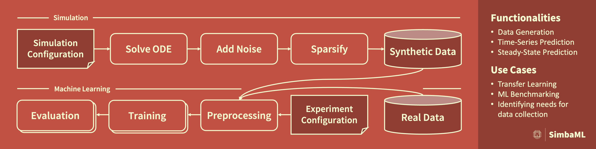

.. _simba_ml_docs_mainpage:

Welcome to the SimbaML Documentation!
=====================================

**Date**: |today| **Version**: |version|

**SimbaML** is an all-in-one framework for integrating prior knowledge of ODE models into the ML process by synthetic data augmentation.
It allows for the convenient generation of realistic synthetic data by sparsifying and adding noise.
Furthermore, our framework provides customizable pipelines for various ML experiments, such as identifying needs for data collection and transfer learning.

**Useful links**:
:ref:`installation` |
`Source Repository <https://github.com/DILiS-lab/SimbaML>`_ |
`Issue Tracker <https://github.com/DILiS-lab/SimbaML/issues>`_ |
`Mailing List <mpws2022br1@hpi.de>`_

Installation
------------

SimbaML requires Python 3.10 or newer and can be installed via pip:

..  code-block:: bash

    pip install simba_ml

You can check if the installation was successful by importing the package and checking the version:

.. code-block:: python

    import simba_ml
    simba_ml.__version__

For more detailed installation instructions and requirements, see :ref:`installation`.

For an example usage of SimbaML, see :ref:`quickstart`.

.. include:: about/cite.rst